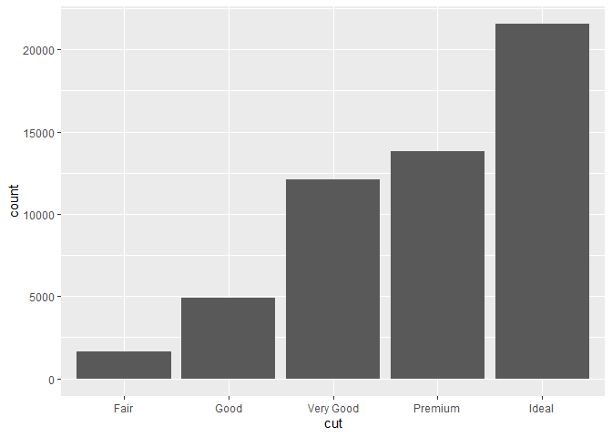
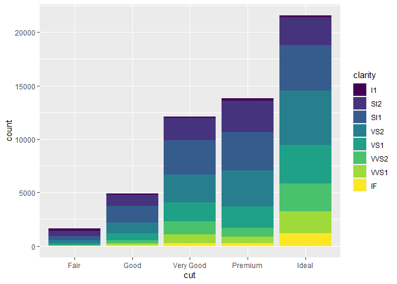

1st script
================
2022-06-30

R markdown은 **R studio**에서 markdown 스크립트를 작성할 수 있게 해주는
형식이다.

# (1) cheatsheet

<https://www.rstudio.com/resources/cheatsheets/>

------------------------------------------------------------------------

``` r
# table 작성법
```

|    제목    | 내용       |
|:----------:|------------|
| 안녕하세요 | 안녕하세요 |

``` r
library(tidyverse)
```

    ## Warning: 패키지 'tidyverse'는 R 버전 4.1.2에서 작성되었습니다

    ## -- Attaching packages --------------------------------------- tidyverse 1.3.1 --

    ## v ggplot2 3.3.5     v purrr   0.3.4
    ## v tibble  3.1.5     v dplyr   1.0.7
    ## v tidyr   1.1.4     v stringr 1.4.0
    ## v readr   2.1.1     v forcats 0.5.1

    ## Warning: 패키지 'tibble'는 R 버전 4.1.1에서 작성되었습니다

    ## Warning: 패키지 'tidyr'는 R 버전 4.1.1에서 작성되었습니다

    ## Warning: 패키지 'readr'는 R 버전 4.1.2에서 작성되었습니다

    ## Warning: 패키지 'forcats'는 R 버전 4.1.2에서 작성되었습니다

    ## -- Conflicts ------------------------------------------ tidyverse_conflicts() --
    ## x dplyr::filter() masks stats::filter()
    ## x dplyr::lag()    masks stats::lag()

``` r
str(mpg)
```

    ## tibble [234 x 11] (S3: tbl_df/tbl/data.frame)
    ##  $ manufacturer: chr [1:234] "audi" "audi" "audi" "audi" ...
    ##  $ model       : chr [1:234] "a4" "a4" "a4" "a4" ...
    ##  $ displ       : num [1:234] 1.8 1.8 2 2 2.8 2.8 3.1 1.8 1.8 2 ...
    ##  $ year        : int [1:234] 1999 1999 2008 2008 1999 1999 2008 1999 1999 2008 ...
    ##  $ cyl         : int [1:234] 4 4 4 4 6 6 6 4 4 4 ...
    ##  $ trans       : chr [1:234] "auto(l5)" "manual(m5)" "manual(m6)" "auto(av)" ...
    ##  $ drv         : chr [1:234] "f" "f" "f" "f" ...
    ##  $ cty         : int [1:234] 18 21 20 21 16 18 18 18 16 20 ...
    ##  $ hwy         : int [1:234] 29 29 31 30 26 26 27 26 25 28 ...
    ##  $ fl          : chr [1:234] "p" "p" "p" "p" ...
    ##  $ class       : chr [1:234] "compact" "compact" "compact" "compact" ...

``` r
ggplot(data=mpg) +
  geom_point(mapping = aes(x=displ, y=hwy))
```

<!-- -->

``` r
ggplot(data=mpg) +
  geom_point(mapping = aes(x=displ, y=hwy, color="red"))
```

<!-- -->

``` r
# 아래와 같이 범주형 변수로 ggplot 가능
ggplot(data=mpg) +
  geom_point(mapping = aes(x=displ, y=hwy, color=class))
```

<!-- -->

``` r
ggplot(data=mpg) +
  geom_point(mapping = aes(x=displ, y=hwy, size=class))
```

    ## Warning: Using size for a discrete variable is not advised.

<!-- -->

``` r
ggplot(data=mpg) +
  geom_point(mapping = aes(x=displ, y=hwy, alpha=class))
```

    ## Warning: Using alpha for a discrete variable is not advised.

<!-- -->

``` r
# aes 안에 안 넣어도 됨. -> 단 legend가 사라짐
ggplot(data=mpg) +
  geom_point(mapping = aes(x=displ, y=hwy), color="red")
```

<!-- -->

``` r
# 막대 그래프의 경우는 fill 사용.
ggplot(data=mpg) +
  geom_bar(mapping = aes(x=class, color="red"))
```

<!-- -->

``` r
ggplot(data=mpg) +
  geom_bar(mapping = aes(x=class, fill="red"))
```

<!-- -->

``` r
# 여러 가지 가능
ggplot(data=mpg) +
  geom_point(mapping = aes(x=displ, y=hwy, color=class, size=class))
```

    ## Warning: Using size for a discrete variable is not advised.

<!-- -->

``` r
# 조건문도 가능
ggplot(data=mpg) +
  geom_point(mapping = aes(x=displ, y=hwy, color= displ<5))
```

<!-- -->

## (2). 면분할

``` r
# facet

ggplot(data=mpg) +
  geom_point(mapping = aes(x=displ, y=hwy)) +
  facet_wrap(~class, nrow=2)
```

<!-- -->

``` r
ggplot(data=mpg) +
  geom_point(mapping = aes(x=displ, y=hwy)) +
  facet_grid(drv~cyl)
```

<!-- -->

``` r
ggplot(data=diamonds) +
  geom_bar(mapping=aes(x=cut))
```

<!-- -->

``` r
ggplot(data=diamonds) +
  geom_bar(mapping=aes(x=cut, fill=cut))
```

<!-- -->

``` r
ggplot(data=diamonds) +
  geom_bar(mapping=aes(x=cut, fill=clarity))
```

<!-- -->

``` r
# 전역 mapping도 가능
ggplot(data=diamonds, mapping=aes(x=cut, fill=clarity)) +
  geom_bar()
```

<!-- -->

``` r
ggplot(data=diamonds, mapping=aes(x=cut, fill=clarity, y=price)) +
  geom_point()
```

<!-- -->

``` r
# dodge
ggplot(data=diamonds) +
  geom_bar(mapping=aes(x=cut, fill=clarity), position="dodge")
```

<!-- -->

## (3) 좌표계 \_ coordinate System on cheatsheet

``` r
ggplot(data=diamonds) +
  geom_bar(mapping=aes(x=cut, fill=clarity), position="dodge") +
  coord_polar()
```

<!-- -->

``` r
ggplot(data=diamonds) +
  geom_bar(mapping=aes(x=cut, fill=clarity), position="dodge") +
  coord_flip()
```

<!-- -->

\[정리\] ggplot(data=“내가 쓸 데이터”) + <geom 함수>(mapping =
aes(mapping 모음), stat=<stat>, position=<dodge같은거>) + \<좌표계
(coord) 함수\> + \<facet(면분할)\>

``` r
str(diamonds)
```

    ## tibble [53,940 x 10] (S3: tbl_df/tbl/data.frame)
    ##  $ carat  : num [1:53940] 0.23 0.21 0.23 0.29 0.31 0.24 0.24 0.26 0.22 0.23 ...
    ##  $ cut    : Ord.factor w/ 5 levels "Fair"<"Good"<..: 5 4 2 4 2 3 3 3 1 3 ...
    ##  $ color  : Ord.factor w/ 7 levels "D"<"E"<"F"<"G"<..: 2 2 2 6 7 7 6 5 2 5 ...
    ##  $ clarity: Ord.factor w/ 8 levels "I1"<"SI2"<"SI1"<..: 2 3 5 4 2 6 7 3 4 5 ...
    ##  $ depth  : num [1:53940] 61.5 59.8 56.9 62.4 63.3 62.8 62.3 61.9 65.1 59.4 ...
    ##  $ table  : num [1:53940] 55 61 65 58 58 57 57 55 61 61 ...
    ##  $ price  : int [1:53940] 326 326 327 334 335 336 336 337 337 338 ...
    ##  $ x      : num [1:53940] 3.95 3.89 4.05 4.2 4.34 3.94 3.95 4.07 3.87 4 ...
    ##  $ y      : num [1:53940] 3.98 3.84 4.07 4.23 4.35 3.96 3.98 4.11 3.78 4.05 ...
    ##  $ z      : num [1:53940] 2.43 2.31 2.31 2.63 2.75 2.48 2.47 2.53 2.49 2.39 ...

``` r
diamonds_test <- sample(1:nrow(diamonds), size=1000, replace=F)
diamonds_test <- diamonds[diamonds_test,]


fit_lr <- lm(price~carat+cut+clarity, data=diamonds_test)

pred <- fit_lr$fitted.values
real <- diamonds_test$price

# scale_color_manual ; color에 대해서 내가 정해주겠다!
ggplot(data=data.frame(x=diamonds_test$carat, pred=pred, real=real)) +
  geom_point(mapping=aes(x=x, y=real, color="black")) +
  geom_point(mapping=aes(x=x, y=pred, color="red"), alpha=0.5) +
  scale_color_manual(values=c("black", "red"),
                     labels=c("real", "pred"),
                     name="real / pred") +
  geom_smooth(mapping=aes(x=x, y=pred, color="red")) + 
  geom_smooth(mapping=aes(x=x, y=real, color="black")) +
  labs(x="carat", y="price", title="diamonds data regression")
```

    ## `geom_smooth()` using method = 'gam' and formula 'y ~ s(x, bs = "cs")'
    ## `geom_smooth()` using method = 'gam' and formula 'y ~ s(x, bs = "cs")'

<!-- -->
