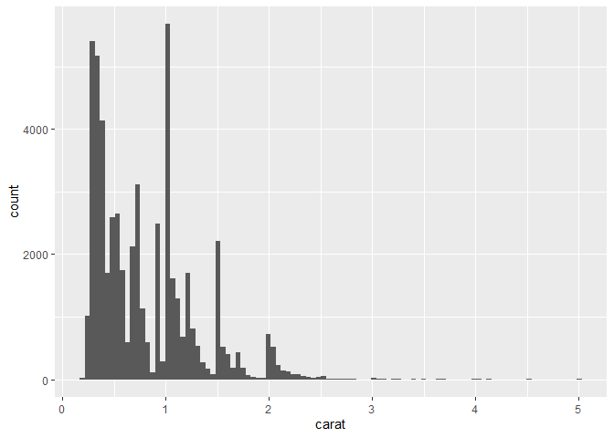
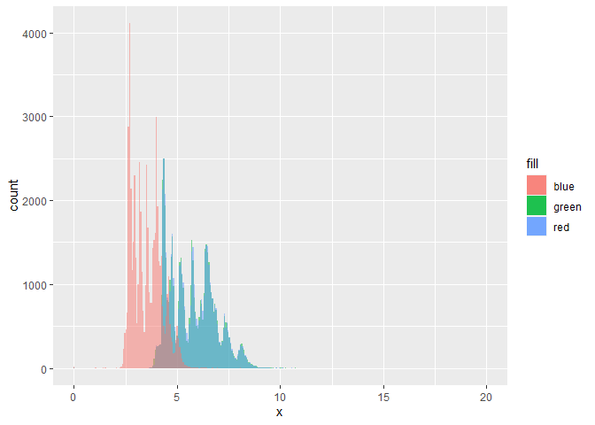
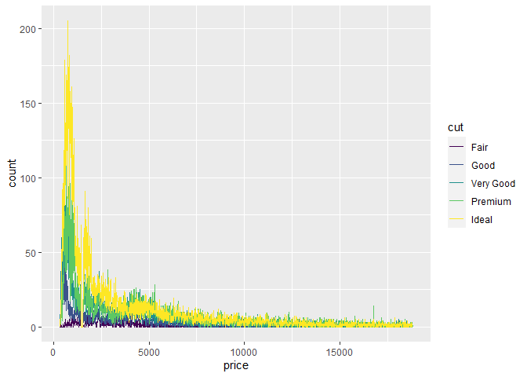

2nd script
================
2022-07-07

# 1. 라이브러리 설정하기

``` r
library(tidyverse)
```

    ## Warning: 패키지 'tidyverse'는 R 버전 4.1.2에서 작성되었습니다

    ## -- Attaching packages --------------------------------------- tidyverse 1.3.1 --

    ## v ggplot2 3.3.5     v purrr   0.3.4
    ## v tibble  3.1.5     v dplyr   1.0.7
    ## v tidyr   1.1.4     v stringr 1.4.0
    ## v readr   2.1.2     v forcats 0.5.1

    ## Warning: 패키지 'tibble'는 R 버전 4.1.1에서 작성되었습니다

    ## Warning: 패키지 'tidyr'는 R 버전 4.1.1에서 작성되었습니다

    ## Warning: 패키지 'readr'는 R 버전 4.1.3에서 작성되었습니다

    ## Warning: 패키지 'forcats'는 R 버전 4.1.2에서 작성되었습니다

    ## -- Conflicts ------------------------------------------ tidyverse_conflicts() --
    ## x dplyr::filter() masks stats::filter()
    ## x dplyr::lag()    masks stats::lag()

``` r
library(MASS)
```

    ## 
    ## 다음의 패키지를 부착합니다: 'MASS'

    ## The following object is masked from 'package:dplyr':
    ## 
    ##     select

# 2. 데이터 타입

``` r
# numeric
x1 <- 10
x2 <- 10.2
# character ; r에서는 ""도 가능 / ''도 가능

# logical
```

## (1) 데이터 타입 확인 함수

``` r
mode(x1)
```

    ## [1] "numeric"

``` r
typeof(x2)
```

    ## [1] "double"

## (2) 데이터 타입 변환

``` r
x1 <- as.character(x1)
```

# 3. 연산자

## (1) 산술 연산자

``` r
3 ** 4 #거듭제곱
```

    ## [1] 81

``` r
3^4
```

    ## [1] 81

``` r
4 %/% 3 # 나눗셈(몫만 구하기)
```

    ## [1] 1

``` r
13 %% 4 # 나눗셈(나머지만 구하기)
```

    ## [1] 1

## (2) 비교 연산자

``` r
3 > 4
```

    ## [1] FALSE

``` r
3 == 4
```

    ## [1] FALSE

``` r
!(3==4)
```

    ## [1] TRUE

``` r
3 %in% c(3,4,5)
```

    ## [1] TRUE

## (3) 논리 연산자

``` r
# && ; 그리고

# || ; 또는
```

# 3. R의 자료구조

## (1) vector

하나의 열(column)으로 구성. 1차원 구조.

데이터 분석의 기본 단위가 됨.

하나의 유형만 가질 수 있음.

``` r
num_vector <- c(1,2,3,4,5)
character_vector <- c("가", "나", "다", "라", "마")
logical_vector <- c(F, F, T, T, T)
```

### vector 초기값

``` r
vector(mode="numeric", length=10)
```

    ##  [1] 0 0 0 0 0 0 0 0 0 0

``` r
vector(mode="character", length=10)
```

    ##  [1] "" "" "" "" "" "" "" "" "" ""

``` r
vector(mode="logical", length=10)
```

    ##  [1] FALSE FALSE FALSE FALSE FALSE FALSE FALSE FALSE FALSE FALSE

### vector 이름 설정

``` r
height <- c(160, 170, 180)
names(height)
```

    ## NULL

``` r
names(height) <- c("A", "B", "C")

height["B"]
```

    ##   B 
    ## 170

### vector 정보 확인하기

``` r
length(height)
```

    ## [1] 3

``` r
mode(height)
```

    ## [1] "numeric"

``` r
is.vector(height)
```

    ## [1] TRUE

### vector의 인덱싱 / 슬라이싱

``` r
weight <- c(10,50,70,55,56,32)

# 첫 번째 요소를 보고 싶다
weight[1]
```

    ## [1] 10

``` r
# 짝수 element 확인하고 싶다
weight[seq(from=2, to=6, by=2)]
```

    ## [1] 50 55 32

``` r
# 슬라이싱
weight[2:length(weight)]
```

    ## [1] 50 70 55 56 32

### vectorization, Recycling Rule

``` r
x <- c(1,2,3,4,5)
y <- c(10,20,30,40,50)
z <- c(1,2,3)

#vectorization
x + y # 이게 자동적으로 됨.
```

    ## [1] 11 22 33 44 55

``` r
#recycling rule
y + z 
```

    ## Warning in y + z: 두 객체의 길이가 서로 배수관계에 있지 않습니다

    ## [1] 11 22 33 41 52

## (2) Factor

범주형 자료를 생성할 수 있는 1차원 구조 하나의 데이터 유형만 가진다.

oredere = TRUE : 순서형 자료

``` r
at <- c("A", "B", "C", "A", "B")

at1 <- factor(at, levels=c("B","A","C"))
at2 <- factor(at, levels=c("B","A","C"), ordered=T)
```

Factor의 인덱싱, 슬라이싱은 vector와 동일

### Factor의 속성

``` r
nlevels(at1) # 범주의 수
```

    ## [1] 3

``` r
is.factor(at1)
```

    ## [1] TRUE

## (3). Matrix

행렬이라고 부르는 행(row)과 열(column)로 구성된 2차원 구조

머신러닝 + 통계 수식에서 많이 쓰이게 된다.

Vector의 확장 버전

### 여러 개의 벡터를 합쳐서 Matrix 만들기

``` r
v1 <- 1:3
v2 <- 4:6
v3 <- 7:9

matrix1 <- rbind(v1, v2, v3)
matrix2 <- cbind(v1, v2, v3)

matrix1
```

    ##    [,1] [,2] [,3]
    ## v1    1    2    3
    ## v2    4    5    6
    ## v3    7    8    9

``` r
matrix2
```

    ##      v1 v2 v3
    ## [1,]  1  4  7
    ## [2,]  2  5  8
    ## [3,]  3  6  9

### matrix 함수로 만들기

``` r
matrix3 <- matrix(data = 1:9, nrow=3, ncol=3)
matrix3
```

    ##      [,1] [,2] [,3]
    ## [1,]    1    4    7
    ## [2,]    2    5    8
    ## [3,]    3    6    9

### matrix의 속성

``` r
nrow(matrix1) # 행
```

    ## [1] 3

``` r
ncol(matrix2) # 열
```

    ## [1] 3

``` r
rownames(matrix1)
```

    ## [1] "v1" "v2" "v3"

``` r
colnames(matrix1)
```

    ## NULL

``` r
dim(matrix1)
```

    ## [1] 3 3

### matrix의 인덱싱/슬라이싱

``` r
M <- mvrnorm(n=10, mu=rep(0, times=10), Sigma=diag(10))

dim(M)
```

    ## [1] 10 10

``` r
# 인덱싱
M[1,] 
```

    ##  [1] -0.575778323  1.424169981  0.430076745 -0.134878777 -0.382829533
    ##  [6] -0.456514104 -0.002534668 -0.110058828  0.911231205 -0.425068295

``` r
M[,1] 
```

    ##  [1] -0.5757783  0.9228937 -0.1983141 -1.5630842 -1.3891279  0.5562067
    ##  [7]  2.7387864 -0.3897515 -0.4162944  1.5894532

``` r
#슬라이싱
M[1:5,] 
```

    ##            [,1]       [,2]        [,3]       [,4]       [,5]       [,6]
    ## [1,] -0.5757783  1.4241700  0.43007675 -0.1348788 -0.3828295 -0.4565141
    ## [2,]  0.9228937 -0.6135357 -0.54527196  0.5727754 -1.4180814  0.1980176
    ## [3,] -0.1983141  0.2741091 -0.79604553 -1.5904865  1.8212087  2.0910424
    ## [4,] -1.5630842 -0.4571084  0.20554136  0.3527189 -1.0797414 -1.9910627
    ## [5,] -1.3891279  0.4026885 -0.06873804 -0.8325162 -0.6881115  0.6650121
    ##              [,7]       [,8]       [,9]      [,10]
    ## [1,] -0.002534668 -0.1100588  0.9112312 -0.4250683
    ## [2,]  1.480337977 -0.3594015 -1.1917029  0.1813905
    ## [3,] -0.069196231 -0.1250515  1.0591467 -0.2384430
    ## [4,]  0.237886087 -0.4732851 -0.1076822 -0.9717567
    ## [5,]  0.807878046 -0.3904742  1.7311349  0.4999242

``` r
M[,1:5]
```

    ##             [,1]        [,2]        [,3]       [,4]        [,5]
    ##  [1,] -0.5757783  1.42416998  0.43007675 -0.1348788 -0.38282953
    ##  [2,]  0.9228937 -0.61353568 -0.54527196  0.5727754 -1.41808142
    ##  [3,] -0.1983141  0.27410911 -0.79604553 -1.5904865  1.82120869
    ##  [4,] -1.5630842 -0.45710843  0.20554136  0.3527189 -1.07974141
    ##  [5,] -1.3891279  0.40268854 -0.06873804 -0.8325162 -0.68811149
    ##  [6,]  0.5562067 -0.01542991 -0.31207474 -0.1961285 -0.91431726
    ##  [7,]  2.7387864 -3.12269086  0.23167960 -0.7939097  0.06002433
    ##  [8,] -0.3897515 -0.20100704 -2.15368445  0.6593633 -1.41738899
    ##  [9,] -0.4162944  0.21923935  0.18728687  1.5320503  0.81043225
    ## [10,]  1.5894532  0.78427205  0.40144453  0.9259122 -1.61098383

### Matrix 연산

``` r
matrix1 %*% matrix2 # 행렬곱
```

    ##    v1  v2  v3
    ## v1 14  32  50
    ## v2 32  77 122
    ## v3 50 122 194

``` r
inverse_M <- solve(M) #역행렬

inverse_M%*%M # 역행렬 확인
```

    ##                [,1]          [,2]          [,3]          [,4]          [,5]
    ##  [1,]  1.000000e+00  1.665335e-16  5.551115e-17  2.220446e-16  2.220446e-16
    ##  [2,] -7.537374e-16  1.000000e+00  6.765422e-17  2.198762e-16 -2.541370e-16
    ##  [3,]  0.000000e+00 -2.220446e-16  1.000000e+00 -4.440892e-16 -4.440892e-16
    ##  [4,]  4.440892e-16  3.330669e-16  9.436896e-16  1.000000e+00 -2.220446e-16
    ##  [5,] -1.110223e-16  7.771561e-16  2.220446e-16  2.775558e-16  1.000000e+00
    ##  [6,]  8.881784e-16 -8.881784e-16  7.771561e-16 -2.220446e-16  0.000000e+00
    ##  [7,] -4.440892e-16 -7.771561e-16 -8.881784e-16  2.220446e-16  1.332268e-15
    ##  [8,]  0.000000e+00 -1.332268e-15 -1.776357e-15  4.440892e-16  1.776357e-15
    ##  [9,] -2.220446e-16  2.775558e-16 -4.996004e-16 -1.110223e-16  6.661338e-16
    ## [10,] -1.110223e-16 -1.110223e-16 -1.942890e-16  5.551115e-17  4.440892e-16
    ##                [,6]          [,7]          [,8]          [,9]         [,10]
    ##  [1,]  2.775558e-17 -1.665335e-16  3.885781e-16 -1.110223e-16 -3.608225e-16
    ##  [2,] -5.470884e-16 -1.456626e-16  1.709245e-16 -8.673617e-19 -4.587259e-16
    ##  [3,] -9.436896e-16  2.775558e-16 -1.665335e-16  0.000000e+00  6.661338e-16
    ##  [4,] -5.551115e-17  8.326673e-17 -2.220446e-16  8.881784e-16  5.551115e-16
    ##  [5,] -1.526557e-16 -3.053113e-16  3.400058e-16  3.330669e-16 -3.608225e-16
    ##  [6,]  1.000000e+00  5.551115e-16 -6.383782e-16  4.440892e-16  7.216450e-16
    ##  [7,]  8.326673e-16  1.000000e+00  6.106227e-16 -1.776357e-15 -1.665335e-16
    ##  [8,]  1.720846e-15 -6.661338e-16  1.000000e+00 -2.220446e-15 -8.881784e-16
    ##  [9,]  4.163336e-17 -2.081668e-16  1.526557e-16  1.000000e+00 -4.163336e-16
    ## [10,]  2.081668e-16 -2.775558e-17 -6.245005e-17  5.551115e-17  1.000000e+00

solve(a,b) 함수는 가우스-조르단 소거법(첨가행렬법)을 사용함
*A**x* = *b*
a=A, b=b에 대응된다. 이때, b의 default값은 단위행렬이다.

``` r
inverse_M <- solve(a=M, b=diag(10))

inverse_M %*% M
```

    ##                [,1]          [,2]          [,3]          [,4]          [,5]
    ##  [1,]  1.000000e+00  1.665335e-16  5.551115e-17  2.220446e-16  2.220446e-16
    ##  [2,] -7.537374e-16  1.000000e+00  6.765422e-17  2.198762e-16 -2.541370e-16
    ##  [3,]  0.000000e+00 -2.220446e-16  1.000000e+00 -4.440892e-16 -4.440892e-16
    ##  [4,]  4.440892e-16  3.330669e-16  9.436896e-16  1.000000e+00 -2.220446e-16
    ##  [5,] -1.110223e-16  7.771561e-16  2.220446e-16  2.775558e-16  1.000000e+00
    ##  [6,]  8.881784e-16 -8.881784e-16  7.771561e-16 -2.220446e-16  0.000000e+00
    ##  [7,] -4.440892e-16 -7.771561e-16 -8.881784e-16  2.220446e-16  1.332268e-15
    ##  [8,]  0.000000e+00 -1.332268e-15 -1.776357e-15  4.440892e-16  1.776357e-15
    ##  [9,] -2.220446e-16  2.775558e-16 -4.996004e-16 -1.110223e-16  6.661338e-16
    ## [10,] -1.110223e-16 -1.110223e-16 -1.942890e-16  5.551115e-17  4.440892e-16
    ##                [,6]          [,7]          [,8]          [,9]         [,10]
    ##  [1,]  2.775558e-17 -1.665335e-16  3.885781e-16 -1.110223e-16 -3.608225e-16
    ##  [2,] -5.470884e-16 -1.456626e-16  1.709245e-16 -8.673617e-19 -4.587259e-16
    ##  [3,] -9.436896e-16  2.775558e-16 -1.665335e-16  0.000000e+00  6.661338e-16
    ##  [4,] -5.551115e-17  8.326673e-17 -2.220446e-16  8.881784e-16  5.551115e-16
    ##  [5,] -1.526557e-16 -3.053113e-16  3.400058e-16  3.330669e-16 -3.608225e-16
    ##  [6,]  1.000000e+00  5.551115e-16 -6.383782e-16  4.440892e-16  7.216450e-16
    ##  [7,]  8.326673e-16  1.000000e+00  6.106227e-16 -1.776357e-15 -1.665335e-16
    ##  [8,]  1.720846e-15 -6.661338e-16  1.000000e+00 -2.220446e-15 -8.881784e-16
    ##  [9,]  4.163336e-17 -2.081668e-16  1.526557e-16  1.000000e+00 -4.163336e-16
    ## [10,]  2.081668e-16 -2.775558e-17 -6.245005e-17  5.551115e-17  1.000000e+00

*M**x* = 0

``` r
solve(a=M, b=rep(0,times=10)) 
```

    ##  [1] 0 0 0 0 0 0 0 0 0 0

``` r
# 0으로 나오는 이유는 M의 공분산이 diag로 x들끼리의 covariate이 없기 때문
```

## (4). Array

3차원 이상의 구조, deep learning에서 사용되는 음성, 이미지, 영상 데이터
정보를 표현하기 위해 사용된다.

``` r
array1 <- array(1:5, dim=c(2,2,2)) # 리싸이클링 룰이 사용되므로 가능
array1
```

    ## , , 1
    ## 
    ##      [,1] [,2]
    ## [1,]    1    3
    ## [2,]    2    4
    ## 
    ## , , 2
    ## 
    ##      [,1] [,2]
    ## [1,]    5    2
    ## [2,]    1    3

## (5). DataFrame

행과 열로 구성되어 있으며 각 열(column)마다 서로 다른 데이터 타입을 가질
수 있다.

``` r
v1 <- c(1,2,3)
v2 <- c("A","B","C")
v3 <- factor(c("양성","음성","음성"), levels=c("음성","양성"))

df1 <- data.frame(v1,v2,v3)

# 변수 이름을 한글로 하고 싶으면 ` 이걸로 가둬줘야 함
df2 <- data.frame(`번호`=v1, `코드`=v2, `판정`=v3)

df2$코드 # 인덱싱
```

    ## [1] "A" "B" "C"

## (6). List

1차원 자료 구조. 모든 자료 구조(벡터, 매트릭스, 데이터프레임)를 전부
포함할 수 있다.

일반적으로 모델 분석 결과를 저장하는 형식이 된다.

``` r
list1 <- list(v1, matrix1, df2)
list2 <- list(list1, v1, matrix1, df2)

names(list2) <- c("list", "vector","matrix","dataframe") 

list1
```

    ## [[1]]
    ## [1] 1 2 3
    ## 
    ## [[2]]
    ##    [,1] [,2] [,3]
    ## v1    1    2    3
    ## v2    4    5    6
    ## v3    7    8    9
    ## 
    ## [[3]]
    ##   번호 코드 판정
    ## 1    1    A 양성
    ## 2    2    B 음성
    ## 3    3    C 음성

``` r
list2
```

    ## $list
    ## $list[[1]]
    ## [1] 1 2 3
    ## 
    ## $list[[2]]
    ##    [,1] [,2] [,3]
    ## v1    1    2    3
    ## v2    4    5    6
    ## v3    7    8    9
    ## 
    ## $list[[3]]
    ##   번호 코드 판정
    ## 1    1    A 양성
    ## 2    2    B 음성
    ## 3    3    C 음성
    ## 
    ## 
    ## $vector
    ## [1] 1 2 3
    ## 
    ## $matrix
    ##    [,1] [,2] [,3]
    ## v1    1    2    3
    ## v2    4    5    6
    ## v3    7    8    9
    ## 
    ## $dataframe
    ##   번호 코드 판정
    ## 1    1    A 양성
    ## 2    2    B 음성
    ## 3    3    C 음성

``` r
list2$list
```

    ## [[1]]
    ## [1] 1 2 3
    ## 
    ## [[2]]
    ##    [,1] [,2] [,3]
    ## v1    1    2    3
    ## v2    4    5    6
    ## v3    7    8    9
    ## 
    ## [[3]]
    ##   번호 코드 판정
    ## 1    1    A 양성
    ## 2    2    B 음성
    ## 3    3    C 음성

``` r
list2$vector # return = 원래 자기 형식(벡터)
```

    ## [1] 1 2 3

``` r
list2[2] # return = list형식
```

    ## $vector
    ## [1] 1 2 3

``` r
list2[[2]] # return = 원래 자기 형식(벡터)
```

    ## [1] 1 2 3

# 5. 데이터 저장/불러오기

## (1). txt 파일

txt문서 작성 : write.table

txt문서 읽기 : read.table

``` r
# 제목이 있음 / 각 요소들이 ,(comma)로 구분되어 있음
W1 <- read.table(file="C://Users//Miru//Desktop//example1.txt",
                 sep=",", header = T)
W1 %>% head()
```

    ##           V1         V2          V3         V4         V5          V6
    ## 1  0.8298172  0.7689981 -0.09484136 -0.4246606  1.4656974  0.05900032
    ## 2 -1.9576082  2.0953832  0.65347988  1.0225792 -0.2914075  2.64464011
    ## 3 -1.2209412  1.1479397 -1.66310296 -1.2309801 -1.0534121  0.01346805
    ## 4 -0.6535137  0.8111694  0.82370233 -0.0889107 -0.8638631  0.34764505
    ## 5 -0.1513197  0.6045210 -0.21931827 -1.1105483  0.2070857 -1.30163731
    ## 6 -0.5756926 -0.9361435  0.22746788  0.4828100 -1.7178502 -0.64261192
    ##            V7          V8          V9        V10
    ## 1 -1.23793897 -0.56955575 -0.26449390  0.6698846
    ## 2 -0.60036501  0.01463061 -0.52446802  0.4553808
    ## 3  1.42027469  0.62233279 -1.21205356 -1.1665286
    ## 4  1.17738919  0.02777406 -0.02456081 -1.0925041
    ## 5 -0.94408294  1.73006963 -0.18644531  0.8850306
    ## 6 -0.04604192 -0.14875891  0.27321847  0.7699581

``` r
# 제목 있음 / 각 요소들이 (spacebar)로 구분 되어 있음
W2 <- read.table(file="C://Users//Miru//Desktop//example2.txt",
                 sep=" ", header = T)


# 제목 있음 / 각 요소들이 (tab)로 구분 되어 있음
W3 <- read.table(file="C://Users//Miru//Desktop//example3.txt",
                 sep="\t", header = T)
```

## (2). csv 파일

readr::write_csv, readr::read_csv : 얘네가 c++로 작성되어서 더 빠름

``` r
install.packages("readr")
```

    ## Warning: 패키지 'readr'가 사용중이므로 설치되지 않을 것입니다

``` r
library(readr)
W <- read_csv(file="C://Users//Miru//Desktop//example.csv",
              col_names = T)
```

    ## Rows: 100 Columns: 10

    ## -- Column specification --------------------------------------------------------
    ## Delimiter: ","
    ## dbl (10): V1, V2, V3, V4, V5, V6, V7, V8, V9, V10

    ## 
    ## i Use `spec()` to retrieve the full column specification for this data.
    ## i Specify the column types or set `show_col_types = FALSE` to quiet this message.

excel, SQL, SAS, SPSS 등의 파일들도 읽어올 수 있음

다른 패키지 필요함.

# 6. 데이터 변형하기

``` r
library(nycflights13)
```

    ## Warning: 패키지 'nycflights13'는 R 버전 4.1.3에서 작성되었습니다

dplyr **핵심 함수**

|   함수명    |                 기능                  |
|:-----------:|:-------------------------------------:|
|  filter()   |         값을 기준으로 행 선택         |
|  select()   |       이름으로 열(변수)을 선택        |
|  mutate()   | 기존 변수들의 함수로 새로운 변수 생성 |
|  arrange()  |              행을 재정렬              |
| summarize() |       하나의 요약값으로 만들기        |
| group_by()  |       그룹마다 동작하도록 설정        |

위의 함수들은 다음과 같은 공통점이 있다. (1) 첫 인수는 데이터
프레임이다. (2) 그 이후의 인수들은 따옴표없이 변수 이름을 사용한다. (3)
데이터 프레임을 반환한다.

## (1). filter()

``` r
str(flights) # tibble은 걍 dataframe이라고 생각하면 됨.
```

    ## tibble [336,776 x 19] (S3: tbl_df/tbl/data.frame)
    ##  $ year          : int [1:336776] 2013 2013 2013 2013 2013 2013 2013 2013 2013 2013 ...
    ##  $ month         : int [1:336776] 1 1 1 1 1 1 1 1 1 1 ...
    ##  $ day           : int [1:336776] 1 1 1 1 1 1 1 1 1 1 ...
    ##  $ dep_time      : int [1:336776] 517 533 542 544 554 554 555 557 557 558 ...
    ##  $ sched_dep_time: int [1:336776] 515 529 540 545 600 558 600 600 600 600 ...
    ##  $ dep_delay     : num [1:336776] 2 4 2 -1 -6 -4 -5 -3 -3 -2 ...
    ##  $ arr_time      : int [1:336776] 830 850 923 1004 812 740 913 709 838 753 ...
    ##  $ sched_arr_time: int [1:336776] 819 830 850 1022 837 728 854 723 846 745 ...
    ##  $ arr_delay     : num [1:336776] 11 20 33 -18 -25 12 19 -14 -8 8 ...
    ##  $ carrier       : chr [1:336776] "UA" "UA" "AA" "B6" ...
    ##  $ flight        : int [1:336776] 1545 1714 1141 725 461 1696 507 5708 79 301 ...
    ##  $ tailnum       : chr [1:336776] "N14228" "N24211" "N619AA" "N804JB" ...
    ##  $ origin        : chr [1:336776] "EWR" "LGA" "JFK" "JFK" ...
    ##  $ dest          : chr [1:336776] "IAH" "IAH" "MIA" "BQN" ...
    ##  $ air_time      : num [1:336776] 227 227 160 183 116 150 158 53 140 138 ...
    ##  $ distance      : num [1:336776] 1400 1416 1089 1576 762 ...
    ##  $ hour          : num [1:336776] 5 5 5 5 6 5 6 6 6 6 ...
    ##  $ minute        : num [1:336776] 15 29 40 45 0 58 0 0 0 0 ...
    ##  $ time_hour     : POSIXct[1:336776], format: "2013-01-01 05:00:00" "2013-01-01 05:00:00" ...

``` r
# 1월 1일인 행만 추출
month1_day1 <- dplyr::filter(flights, month==1, day==1)

# pipe를 이용한 dplyr : 파이프는 모든 함수에 사용할 수 있는 거 였음.
flights %>% filter(month==11 | month==12) %>% head()
```

    ## # A tibble: 6 x 19
    ##    year month   day dep_time sched_dep_time dep_delay arr_time sched_arr_time
    ##   <int> <int> <int>    <int>          <int>     <dbl>    <int>          <int>
    ## 1  2013    11     1        5           2359         6      352            345
    ## 2  2013    11     1       35           2250       105      123           2356
    ## 3  2013    11     1      455            500        -5      641            651
    ## 4  2013    11     1      539            545        -6      856            827
    ## 5  2013    11     1      542            545        -3      831            855
    ## 6  2013    11     1      549            600       -11      912            923
    ## # ... with 11 more variables: arr_delay <dbl>, carrier <chr>, flight <int>,
    ## #   tailnum <chr>, origin <chr>, dest <chr>, air_time <dbl>, distance <dbl>,
    ## #   hour <dbl>, minute <dbl>, time_hour <dttm>

``` r
flights %>% filter(month %in% c(11,12)) %>% head()
```

    ## # A tibble: 6 x 19
    ##    year month   day dep_time sched_dep_time dep_delay arr_time sched_arr_time
    ##   <int> <int> <int>    <int>          <int>     <dbl>    <int>          <int>
    ## 1  2013    11     1        5           2359         6      352            345
    ## 2  2013    11     1       35           2250       105      123           2356
    ## 3  2013    11     1      455            500        -5      641            651
    ## 4  2013    11     1      539            545        -6      856            827
    ## 5  2013    11     1      542            545        -3      831            855
    ## 6  2013    11     1      549            600       -11      912            923
    ## # ... with 11 more variables: arr_delay <dbl>, carrier <chr>, flight <int>,
    ## #   tailnum <chr>, origin <chr>, dest <chr>, air_time <dbl>, distance <dbl>,
    ## #   hour <dbl>, minute <dbl>, time_hour <dttm>

``` r
# 아래 두 식은 동일한 표현이다.
filter(flights, !(arr_delay>120 | dep_delay>120))
```

    ## # A tibble: 316,050 x 19
    ##     year month   day dep_time sched_dep_time dep_delay arr_time sched_arr_time
    ##    <int> <int> <int>    <int>          <int>     <dbl>    <int>          <int>
    ##  1  2013     1     1      517            515         2      830            819
    ##  2  2013     1     1      533            529         4      850            830
    ##  3  2013     1     1      542            540         2      923            850
    ##  4  2013     1     1      544            545        -1     1004           1022
    ##  5  2013     1     1      554            600        -6      812            837
    ##  6  2013     1     1      554            558        -4      740            728
    ##  7  2013     1     1      555            600        -5      913            854
    ##  8  2013     1     1      557            600        -3      709            723
    ##  9  2013     1     1      557            600        -3      838            846
    ## 10  2013     1     1      558            600        -2      753            745
    ## # ... with 316,040 more rows, and 11 more variables: arr_delay <dbl>,
    ## #   carrier <chr>, flight <int>, tailnum <chr>, origin <chr>, dest <chr>,
    ## #   air_time <dbl>, distance <dbl>, hour <dbl>, minute <dbl>, time_hour <dttm>

``` r
filter(flights, arr_delay<=120 & dep_delay<=120)
```

    ## # A tibble: 316,050 x 19
    ##     year month   day dep_time sched_dep_time dep_delay arr_time sched_arr_time
    ##    <int> <int> <int>    <int>          <int>     <dbl>    <int>          <int>
    ##  1  2013     1     1      517            515         2      830            819
    ##  2  2013     1     1      533            529         4      850            830
    ##  3  2013     1     1      542            540         2      923            850
    ##  4  2013     1     1      544            545        -1     1004           1022
    ##  5  2013     1     1      554            600        -6      812            837
    ##  6  2013     1     1      554            558        -4      740            728
    ##  7  2013     1     1      555            600        -5      913            854
    ##  8  2013     1     1      557            600        -3      709            723
    ##  9  2013     1     1      557            600        -3      838            846
    ## 10  2013     1     1      558            600        -2      753            745
    ## # ... with 316,040 more rows, and 11 more variables: arr_delay <dbl>,
    ## #   carrier <chr>, flight <int>, tailnum <chr>, origin <chr>, dest <chr>,
    ## #   air_time <dbl>, distance <dbl>, hour <dbl>, minute <dbl>, time_hour <dttm>

``` r
df <- data.frame(x=c(1,NA,3))

# filter는 false가 나오는 건 모두 제외 따라서 NA 는 안나옴
filter(df, x>1)
```

    ##   x
    ## 1 3

1)  filter를 이용하여 dest가 IAH 또는 HOU으로 운항하는 행을 찾아라.

``` r
str(flights)
```

    ## tibble [336,776 x 19] (S3: tbl_df/tbl/data.frame)
    ##  $ year          : int [1:336776] 2013 2013 2013 2013 2013 2013 2013 2013 2013 2013 ...
    ##  $ month         : int [1:336776] 1 1 1 1 1 1 1 1 1 1 ...
    ##  $ day           : int [1:336776] 1 1 1 1 1 1 1 1 1 1 ...
    ##  $ dep_time      : int [1:336776] 517 533 542 544 554 554 555 557 557 558 ...
    ##  $ sched_dep_time: int [1:336776] 515 529 540 545 600 558 600 600 600 600 ...
    ##  $ dep_delay     : num [1:336776] 2 4 2 -1 -6 -4 -5 -3 -3 -2 ...
    ##  $ arr_time      : int [1:336776] 830 850 923 1004 812 740 913 709 838 753 ...
    ##  $ sched_arr_time: int [1:336776] 819 830 850 1022 837 728 854 723 846 745 ...
    ##  $ arr_delay     : num [1:336776] 11 20 33 -18 -25 12 19 -14 -8 8 ...
    ##  $ carrier       : chr [1:336776] "UA" "UA" "AA" "B6" ...
    ##  $ flight        : int [1:336776] 1545 1714 1141 725 461 1696 507 5708 79 301 ...
    ##  $ tailnum       : chr [1:336776] "N14228" "N24211" "N619AA" "N804JB" ...
    ##  $ origin        : chr [1:336776] "EWR" "LGA" "JFK" "JFK" ...
    ##  $ dest          : chr [1:336776] "IAH" "IAH" "MIA" "BQN" ...
    ##  $ air_time      : num [1:336776] 227 227 160 183 116 150 158 53 140 138 ...
    ##  $ distance      : num [1:336776] 1400 1416 1089 1576 762 ...
    ##  $ hour          : num [1:336776] 5 5 5 5 6 5 6 6 6 6 ...
    ##  $ minute        : num [1:336776] 15 29 40 45 0 58 0 0 0 0 ...
    ##  $ time_hour     : POSIXct[1:336776], format: "2013-01-01 05:00:00" "2013-01-01 05:00:00" ...

``` r
flights %>% filter(dest=="IAH" | dest=="HOU")
```

    ## # A tibble: 9,313 x 19
    ##     year month   day dep_time sched_dep_time dep_delay arr_time sched_arr_time
    ##    <int> <int> <int>    <int>          <int>     <dbl>    <int>          <int>
    ##  1  2013     1     1      517            515         2      830            819
    ##  2  2013     1     1      533            529         4      850            830
    ##  3  2013     1     1      623            627        -4      933            932
    ##  4  2013     1     1      728            732        -4     1041           1038
    ##  5  2013     1     1      739            739         0     1104           1038
    ##  6  2013     1     1      908            908         0     1228           1219
    ##  7  2013     1     1     1028           1026         2     1350           1339
    ##  8  2013     1     1     1044           1045        -1     1352           1351
    ##  9  2013     1     1     1114            900       134     1447           1222
    ## 10  2013     1     1     1205           1200         5     1503           1505
    ## # ... with 9,303 more rows, and 11 more variables: arr_delay <dbl>,
    ## #   carrier <chr>, flight <int>, tailnum <chr>, origin <chr>, dest <chr>,
    ## #   air_time <dbl>, distance <dbl>, hour <dbl>, minute <dbl>, time_hour <dttm>

``` r
flights %>% filter(carrier %in% c("UA","AA","DL"))
```

    ## # A tibble: 139,504 x 19
    ##     year month   day dep_time sched_dep_time dep_delay arr_time sched_arr_time
    ##    <int> <int> <int>    <int>          <int>     <dbl>    <int>          <int>
    ##  1  2013     1     1      517            515         2      830            819
    ##  2  2013     1     1      533            529         4      850            830
    ##  3  2013     1     1      542            540         2      923            850
    ##  4  2013     1     1      554            600        -6      812            837
    ##  5  2013     1     1      554            558        -4      740            728
    ##  6  2013     1     1      558            600        -2      753            745
    ##  7  2013     1     1      558            600        -2      924            917
    ##  8  2013     1     1      558            600        -2      923            937
    ##  9  2013     1     1      559            600        -1      941            910
    ## 10  2013     1     1      559            600        -1      854            902
    ## # ... with 139,494 more rows, and 11 more variables: arr_delay <dbl>,
    ## #   carrier <chr>, flight <int>, tailnum <chr>, origin <chr>, dest <chr>,
    ## #   air_time <dbl>, distance <dbl>, hour <dbl>, minute <dbl>, time_hour <dttm>

## (2) arrange()로 행 정렬하기

``` r
# 오름차순으로 정렬해주는 함수
arrange(flights, year, month, day)
```

    ## # A tibble: 336,776 x 19
    ##     year month   day dep_time sched_dep_time dep_delay arr_time sched_arr_time
    ##    <int> <int> <int>    <int>          <int>     <dbl>    <int>          <int>
    ##  1  2013     1     1      517            515         2      830            819
    ##  2  2013     1     1      533            529         4      850            830
    ##  3  2013     1     1      542            540         2      923            850
    ##  4  2013     1     1      544            545        -1     1004           1022
    ##  5  2013     1     1      554            600        -6      812            837
    ##  6  2013     1     1      554            558        -4      740            728
    ##  7  2013     1     1      555            600        -5      913            854
    ##  8  2013     1     1      557            600        -3      709            723
    ##  9  2013     1     1      557            600        -3      838            846
    ## 10  2013     1     1      558            600        -2      753            745
    ## # ... with 336,766 more rows, and 11 more variables: arr_delay <dbl>,
    ## #   carrier <chr>, flight <int>, tailnum <chr>, origin <chr>, dest <chr>,
    ## #   air_time <dbl>, distance <dbl>, hour <dbl>, minute <dbl>, time_hour <dttm>

``` r
# desc를 이용하여 month만 내림차순으로 정렬
arrange(flights, year, desc(month))
```

    ## # A tibble: 336,776 x 19
    ##     year month   day dep_time sched_dep_time dep_delay arr_time sched_arr_time
    ##    <int> <int> <int>    <int>          <int>     <dbl>    <int>          <int>
    ##  1  2013    12     1       13           2359        14      446            445
    ##  2  2013    12     1       17           2359        18      443            437
    ##  3  2013    12     1      453            500        -7      636            651
    ##  4  2013    12     1      520            515         5      749            808
    ##  5  2013    12     1      536            540        -4      845            850
    ##  6  2013    12     1      540            550       -10     1005           1027
    ##  7  2013    12     1      541            545        -4      734            755
    ##  8  2013    12     1      546            545         1      826            835
    ##  9  2013    12     1      549            600       -11      648            659
    ## 10  2013    12     1      550            600       -10      825            854
    ## # ... with 336,766 more rows, and 11 more variables: arr_delay <dbl>,
    ## #   carrier <chr>, flight <int>, tailnum <chr>, origin <chr>, dest <chr>,
    ## #   air_time <dbl>, distance <dbl>, hour <dbl>, minute <dbl>, time_hour <dttm>

``` r
# 음수로 바꾸어 줌
desc(c(1:3))
```

    ## [1] -1 -2 -3

``` r
# desc를 이용하여 NA값이 먼저 나오도록 설정
arrange(flights, desc(is.na(dep_time)))
```

    ## # A tibble: 336,776 x 19
    ##     year month   day dep_time sched_dep_time dep_delay arr_time sched_arr_time
    ##    <int> <int> <int>    <int>          <int>     <dbl>    <int>          <int>
    ##  1  2013     1     1       NA           1630        NA       NA           1815
    ##  2  2013     1     1       NA           1935        NA       NA           2240
    ##  3  2013     1     1       NA           1500        NA       NA           1825
    ##  4  2013     1     1       NA            600        NA       NA            901
    ##  5  2013     1     2       NA           1540        NA       NA           1747
    ##  6  2013     1     2       NA           1620        NA       NA           1746
    ##  7  2013     1     2       NA           1355        NA       NA           1459
    ##  8  2013     1     2       NA           1420        NA       NA           1644
    ##  9  2013     1     2       NA           1321        NA       NA           1536
    ## 10  2013     1     2       NA           1545        NA       NA           1910
    ## # ... with 336,766 more rows, and 11 more variables: arr_delay <dbl>,
    ## #   carrier <chr>, flight <int>, tailnum <chr>, origin <chr>, dest <chr>,
    ## #   air_time <dbl>, distance <dbl>, hour <dbl>, minute <dbl>, time_hour <dttm>

## (3) select()로 열 선택하기

starts_with(“char”) : 해당 문자로 시작하는 변수에 매칭

ends_with(“char”) : 해당 문자로 끝나는 변수에 매칭

contains(“char”) : 해당 문자를 포함하는 변수에 매칭

matches(“(.)\\1”) : 정규표현식에 매칭되는 변수 선택

num_range(“x”,1:3) : x1, x2, x3에 매칭되는 변수 선택

``` r
dplyr::select(flights, year, month, day)
```

    ## # A tibble: 336,776 x 3
    ##     year month   day
    ##    <int> <int> <int>
    ##  1  2013     1     1
    ##  2  2013     1     1
    ##  3  2013     1     1
    ##  4  2013     1     1
    ##  5  2013     1     1
    ##  6  2013     1     1
    ##  7  2013     1     1
    ##  8  2013     1     1
    ##  9  2013     1     1
    ## 10  2013     1     1
    ## # ... with 336,766 more rows

``` r
dplyr::select(flights, year:day)
```

    ## # A tibble: 336,776 x 3
    ##     year month   day
    ##    <int> <int> <int>
    ##  1  2013     1     1
    ##  2  2013     1     1
    ##  3  2013     1     1
    ##  4  2013     1     1
    ##  5  2013     1     1
    ##  6  2013     1     1
    ##  7  2013     1     1
    ##  8  2013     1     1
    ##  9  2013     1     1
    ## 10  2013     1     1
    ## # ... with 336,766 more rows

``` r
# 선택한 걸 빼고 싶으면
dplyr::select(flights, -c(year:day), everything())
```

    ## # A tibble: 336,776 x 19
    ##    dep_time sched_dep_time dep_delay arr_time sched_arr_time arr_delay carrier
    ##       <int>          <int>     <dbl>    <int>          <int>     <dbl> <chr>  
    ##  1      517            515         2      830            819        11 UA     
    ##  2      533            529         4      850            830        20 UA     
    ##  3      542            540         2      923            850        33 AA     
    ##  4      544            545        -1     1004           1022       -18 B6     
    ##  5      554            600        -6      812            837       -25 DL     
    ##  6      554            558        -4      740            728        12 UA     
    ##  7      555            600        -5      913            854        19 B6     
    ##  8      557            600        -3      709            723       -14 EV     
    ##  9      557            600        -3      838            846        -8 B6     
    ## 10      558            600        -2      753            745         8 AA     
    ## # ... with 336,766 more rows, and 12 more variables: flight <int>,
    ## #   tailnum <chr>, origin <chr>, dest <chr>, air_time <dbl>, distance <dbl>,
    ## #   hour <dbl>, minute <dbl>, time_hour <dttm>, year <int>, month <int>,
    ## #   day <int>

``` r
# d로 시작하는 변수명인 애들을 가져옴.
dplyr::select(flights, starts_with("d"))
```

    ## # A tibble: 336,776 x 5
    ##      day dep_time dep_delay dest  distance
    ##    <int>    <int>     <dbl> <chr>    <dbl>
    ##  1     1      517         2 IAH       1400
    ##  2     1      533         4 IAH       1416
    ##  3     1      542         2 MIA       1089
    ##  4     1      544        -1 BQN       1576
    ##  5     1      554        -6 ATL        762
    ##  6     1      554        -4 ORD        719
    ##  7     1      555        -5 FLL       1065
    ##  8     1      557        -3 IAD        229
    ##  9     1      557        -3 MCO        944
    ## 10     1      558        -2 ORD        733
    ## # ... with 336,766 more rows

## (4) mutate()로 새로운 변수 추가하기

``` r
sample_flights <- flights %>% dplyr::select(year:day, 
                                            ends_with("delay"),
                                            distance,
                                            air_time)

sample_flights %>% head()
```

    ## # A tibble: 6 x 7
    ##    year month   day dep_delay arr_delay distance air_time
    ##   <int> <int> <int>     <dbl>     <dbl>    <dbl>    <dbl>
    ## 1  2013     1     1         2        11     1400      227
    ## 2  2013     1     1         4        20     1416      227
    ## 3  2013     1     1         2        33     1089      160
    ## 4  2013     1     1        -1       -18     1576      183
    ## 5  2013     1     1        -6       -25      762      116
    ## 6  2013     1     1        -4        12      719      150

``` r
dplyr::mutate(sample_flights,
              gain=arr_delay - dep_delay,
              speed = distance / air_time * 60,
              hours = air_time/60,
              gain_per_hour=gain/hours) %>% head()
```

    ## # A tibble: 6 x 11
    ##    year month   day dep_delay arr_delay distance air_time  gain speed hours
    ##   <int> <int> <int>     <dbl>     <dbl>    <dbl>    <dbl> <dbl> <dbl> <dbl>
    ## 1  2013     1     1         2        11     1400      227     9  370.  3.78
    ## 2  2013     1     1         4        20     1416      227    16  374.  3.78
    ## 3  2013     1     1         2        33     1089      160    31  408.  2.67
    ## 4  2013     1     1        -1       -18     1576      183   -17  517.  3.05
    ## 5  2013     1     1        -6       -25      762      116   -19  394.  1.93
    ## 6  2013     1     1        -4        12      719      150    16  288.  2.5 
    ## # ... with 1 more variable: gain_per_hour <dbl>

``` r
# 새로 만든 변수만 나옴.
dplyr::transmute(sample_flights,
              gain=arr_delay - dep_delay,
              speed = distance / air_time * 60,
              hours = air_time/60,
              gain_per_hour=gain/hours) %>% head()
```

    ## # A tibble: 6 x 4
    ##    gain speed hours gain_per_hour
    ##   <dbl> <dbl> <dbl>         <dbl>
    ## 1     9  370.  3.78          2.38
    ## 2    16  374.  3.78          4.23
    ## 3    31  408.  2.67         11.6 
    ## 4   -17  517.  3.05         -5.57
    ## 5   -19  394.  1.93         -9.83
    ## 6    16  288.  2.5           6.4

``` r
dplyr::mutate(sample_flights,
              dummy_month=ifelse(month>6, 1, 0)) %>% head()
```

    ## # A tibble: 6 x 8
    ##    year month   day dep_delay arr_delay distance air_time dummy_month
    ##   <int> <int> <int>     <dbl>     <dbl>    <dbl>    <dbl>       <dbl>
    ## 1  2013     1     1         2        11     1400      227           0
    ## 2  2013     1     1         4        20     1416      227           0
    ## 3  2013     1     1         2        33     1089      160           0
    ## 4  2013     1     1        -1       -18     1576      183           0
    ## 5  2013     1     1        -6       -25      762      116           0
    ## 6  2013     1     1        -4        12      719      150           0

cumsum() : 누적 합계 cumprod() : 누적 곱셈 cummin() : 누적 최솟값
cummax() : 누적 최댓값 cummean() : 누적 평균

``` r
dplyr::mutate(sample_flights,
              cum_min = cummin(dep_delay),
              cum_max = cummax(dep_delay),
              cum_sum = cumsum(dep_delay))
```

    ## # A tibble: 336,776 x 10
    ##     year month   day dep_delay arr_delay distance air_time cum_min cum_max
    ##    <int> <int> <int>     <dbl>     <dbl>    <dbl>    <dbl>   <dbl>   <dbl>
    ##  1  2013     1     1         2        11     1400      227       2       2
    ##  2  2013     1     1         4        20     1416      227       2       4
    ##  3  2013     1     1         2        33     1089      160       2       4
    ##  4  2013     1     1        -1       -18     1576      183      -1       4
    ##  5  2013     1     1        -6       -25      762      116      -6       4
    ##  6  2013     1     1        -4        12      719      150      -6       4
    ##  7  2013     1     1        -5        19     1065      158      -6       4
    ##  8  2013     1     1        -3       -14      229       53      -6       4
    ##  9  2013     1     1        -3        -8      944      140      -6       4
    ## 10  2013     1     1        -2         8      733      138      -6       4
    ## # ... with 336,766 more rows, and 1 more variable: cum_sum <dbl>

## (5). summarize()로 그룹화 요악하기

group_by를 통해 분석의 단위를 전체 데이처셋에서 개별 그룹으로 변경할 수
있다.

그룹마다 함수를 적용할 수 있다.

``` r
# n은 summarise 안에서 변수의 개수를 세주는 함수
dplyr::summarise(flights,
                 n=n(),
                 delay=mean(dep_delay, na.rm=T)) %>% head()
```

    ## # A tibble: 1 x 2
    ##        n delay
    ##    <int> <dbl>
    ## 1 336776  12.6

``` r
# group_by와 같이 쓸 경우
flights %>% 
  dplyr::group_by(year, month) %>%
  dplyr::summarise(n=n(),
                 delay=mean(dep_delay, na.rm=T)) %>% head()
```

    ## `summarise()` has grouped output by 'year'. You can override using the `.groups` argument.

    ## # A tibble: 6 x 4
    ## # Groups:   year [1]
    ##    year month     n delay
    ##   <int> <int> <int> <dbl>
    ## 1  2013     1 27004  10.0
    ## 2  2013     2 24951  10.8
    ## 3  2013     3 28834  13.2
    ## 4  2013     4 28330  13.9
    ## 5  2013     5 28796  13.0
    ## 6  2013     6 28243  20.8

유용한 요약함수들

median() sd() IQR() mad() : 중위절대편차 - 이상치 있을 때 좋은 요약치
n() : 현재 그룹의 크기를 반환

``` r
flights %>% 
  dplyr::select(year, month, day, dep_time) %>%
  dplyr::filter(is.na(dep_time) == F) %>%
  dplyr::group_by(year, month) %>%
  dplyr::summarise(n=n(),
                   dep_mean=mean(dep_time))
```

    ## `summarise()` has grouped output by 'year'. You can override using the `.groups` argument.

    ## # A tibble: 12 x 4
    ## # Groups:   year [1]
    ##     year month     n dep_mean
    ##    <int> <int> <int>    <dbl>
    ##  1  2013     1 26483    1347.
    ##  2  2013     2 23690    1348.
    ##  3  2013     3 27973    1359.
    ##  4  2013     4 27662    1353.
    ##  5  2013     5 28233    1351.
    ##  6  2013     6 27234    1351.
    ##  7  2013     7 28485    1353.
    ##  8  2013     8 28841    1350.
    ##  9  2013     9 27122    1334.
    ## 10  2013    10 28653    1340.
    ## 11  2013    11 27035    1344.
    ## 12  2013    12 27110    1357.

# 7. 탐색적 데이터 분석(EDA)

EDA는 데이터 분석에서 가장 중요한 부분을 차지한다.

EDA의 목표는 데이터를 이해하는 것.

## (1). 변동(variation)

변수들의 고유한 변동 패턴을 파악하기 위해 변수들 값의 **분포를
시각화**하는 것이 좋다.

``` r
# 히스토그램을 이용하여 데이터 분포 확인하기
ggplot(data=diamonds) +
  geom_histogram(mapping=aes(x=carat), bins=100)
```

<!-- -->

``` r
cut_width(diamonds$carat, 0.5) %>% table()
```

    ## .
    ## [-0.25,0.25]  (0.25,0.75]  (0.75,1.25]  (1.25,1.75]  (1.75,2.25]  (2.25,2.75] 
    ##          785        29498        15977         5313         2002          322 
    ##  (2.75,3.25]  (3.25,3.75]  (3.75,4.25]  (4.25,4.75]  (4.75,5.25] 
    ##           32            5            4            1            1

``` r
# cut_width를 활용하여 데이터 분포 확인하기
diamonds %>%
  dplyr::count(cut_width(carat, 0.5)) %>% head()
```

    ## # A tibble: 6 x 2
    ##   `cut_width(carat, 0.5)`     n
    ##   <fct>                   <int>
    ## 1 [-0.25,0.25]              785
    ## 2 (0.25,0.75]             29498
    ## 3 (0.75,1.25]             15977
    ## 4 (1.25,1.75]              5313
    ## 5 (1.75,2.25]              2002
    ## 6 (2.25,2.75]               322

``` r
# geom_freqpoly()를 사용하여 여러 개의 히스토그램을 겹쳐서 그리기
ggplot(data=diamonds, mapping=aes(x=carat, color=cut)) +
  geom_freqpoly()
```

    ## `stat_bin()` using `bins = 30`. Pick better value with `binwidth`.

<!-- -->

변동의 이상값을 확인(비정상적인 관측값)

``` r
ggplot(data=diamonds) +
  geom_histogram(mapping=aes(x=y),
                 binwidth = 0.5) + 
  coord_cartesian(ylim=c(0,50))
```

<!-- -->

# 실습3 - 연습문제

``` r
# (1) diamonds의 x,y,z 변수의 분포를 탐색하자.
# 어떤 치수가 길이 너비 깊이인지 결정해보자.
str(diamonds[,c("x","y","z")])
```

    ## tibble [53,940 x 3] (S3: tbl_df/tbl/data.frame)
    ##  $ x: num [1:53940] 3.95 3.89 4.05 4.2 4.34 3.94 3.95 4.07 3.87 4 ...
    ##  $ y: num [1:53940] 3.98 3.84 4.07 4.23 4.35 3.96 3.98 4.11 3.78 4.05 ...
    ##  $ z: num [1:53940] 2.43 2.31 2.31 2.63 2.75 2.48 2.47 2.53 2.49 2.39 ...

``` r
ggplot(data=diamonds) +
  geom_histogram(mapping=aes(x=x, fill="green"),
                 alpha=0.5,
                 bins=1000) +
  geom_histogram(mapping=aes(x=y, fill="red"),
                 alpha=0.5,
                 bins=1000) +
  geom_histogram(mapping=aes(x=z, fill="blue"),
                 alpha=0.5,
                 bins=1000) +
  coord_cartesian(xlim=c(0,20))
```

<!-- -->

``` r
# (2) price의 분포를 확인하기(binwidth 사용)
ggplot(data=diamonds) +
  geom_freqpoly(mapping=aes(x=price, color=cut),
                binwidth=10)
```

<!-- -->
